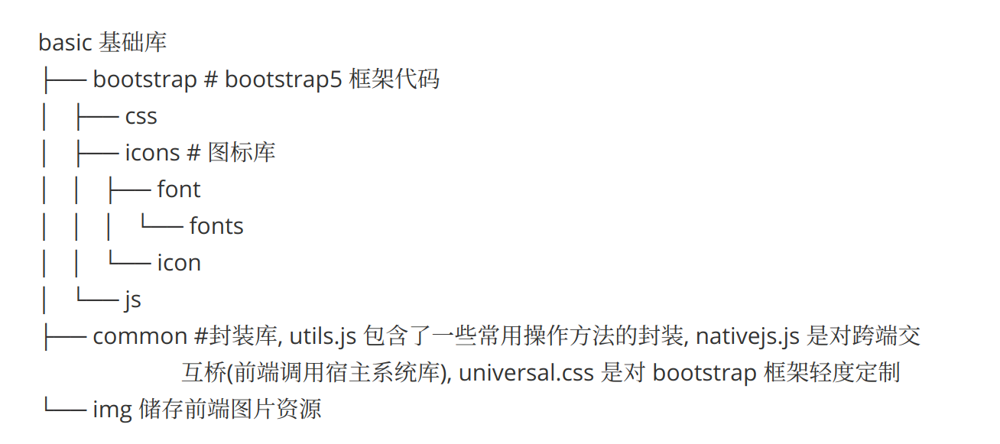

# Yumcalc

#### 项目进度

初始化阶段

#### 项目任务

- [x] 完成导入界面设计
- [ ] 实现导入界面功能（记录对话框信息并储存）
- [ ] 完成解析界面设计
- [ ] 完成解析界面功能（解析导入文件）

#### 项目说明

##### **basic 文件夹**

##### 注意

**所有资源都应该储存在 basic 库中！！**

当你引用了新的三方库时，应在 `basic` 文件夹中新建一个文件夹 `thirds` ，并将后续依赖三方库储存于此。

当你引用了一段视频时，应在 `basic` 文件夹中新建一个文件夹 `videos` ，并将后续依赖三方库储存于此。

当你引用了一段音频时，应在 `basic` 文件夹中新建一个文件夹 `sounds` ，并将后续依赖三方库储存于此。

.....

类似均以此类推。

##### 编程注意

在编写前端网页时，要多看 [Bootstrap5](https://v5.bootcss.com/docs/5.3/getting-started/introduction/) 官方文档。

在编写 Js 时，可以复用 utils.js 中的封装方法，如 `$neo()` , `$()` 等，避免重复代码的出现。同时，对于晦涩难懂的代码，要做好解释。编写代码的时，应规范变量、函数名的规范命名，应做好必要的注释。

对于复杂逻辑者，要做好充分的单元测试。推荐在副本或副分支中改进，待无误后再合并进本地主分支中去。

---

**文档编辑**

> hazukie
> 2024年05月10日星期五 22:12:05 CST
